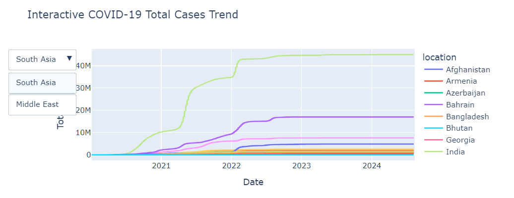
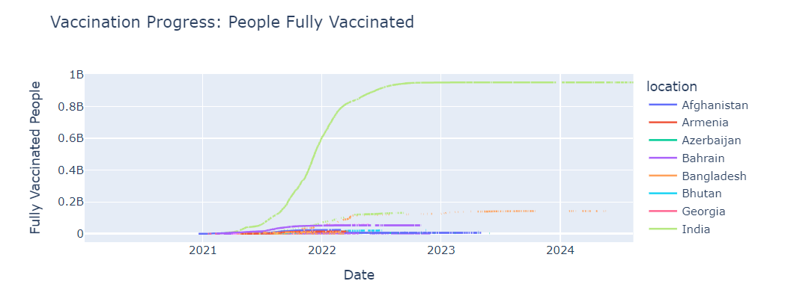
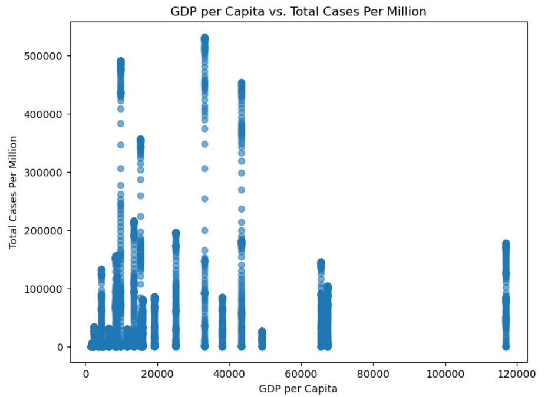

# COVID-19 Regional Analysis: South Asia vs Middle East

## 📖 Overview
This project provides an in-depth analysis of the COVID-19 pandemic's impact across South Asia and the Middle East. It explores trends, vaccination progress, statistical relationships, and predictive insights, offering visualizations and actionable insights.

### Key Focus Areas:
- **COVID-19 Trends**: Analyze total cases, positivity rates, and ICU patient trends.
- **Vaccination Progress**: Investigate the relationship between GDP, population density, and vaccination rates.
- **Statistical Testing**: Perform hypothesis testing (t-test) to compare vaccination progress across regions.
- **Predictive Modeling**: Use linear regression to predict total cases based on key factors.

---

## ✨ Key Features
- 📈 **Time-Series Trends**: Visualize total cases, vaccination progress, and positivity rates with interactive plots.
- 🔗 **Automated Updates**: Weekly updates of COVID-19 data using GitHub Actions.
- 📊 **Correlation Analysis**: Uncover relationships between GDP, vaccination progress, and population density.
- 🔍 **Predictive Modeling**: Linear regression to identify factors influencing total cases.
- 🔬 **Hypothesis Testing**: Compare vaccination progress between South Asia and the Middle East.
- 📂 **Interactive Analysis**: Use dropdown selectors for country-specific insights.

---

## 📊 Dataset
- **Source**: [Our World in Data](https://ourworldindata.org/coronavirus)
- **File**: `data/owid-covid-data.csv`
- **Description**:
  - Global COVID-19 statistics: total cases, deaths, vaccination data.
  - Economic and demographic data: GDP per capita, population density.

---

## 🛠️ How to Set Up and Run

### 1️⃣ Clone the Repository
```bash
git clone https://github.com/yourusername/COVID-19-Regional-Analysis.git
cd COVID-19-Regional-Analysis
```

### 2️⃣ Set Up a Virtual Environment
It’s recommended to use a virtual environment for dependency isolation:
```bash
python -m venv venv
```

Activate the virtual environment:
- **Windows**:
  ```bash
  venv\Scripts\activate
  ```
- **macOS/Linux**:
  ```bash
  source venv/bin/activate
  ```

### 3️⃣ Install Dependencies
```bash
pip install -r requirements.txt
```

### 4️⃣ Run the Analysis
#### Option 1: Using Jupyter Notebook
Navigate to the `notebook` directory and start the Jupyter Notebook:
```bash
cd notebook
jupyter notebook
```

Open `covid-analysis.ipynb` in your browser.

#### Option 2: Automated Update Workflow
This project includes a **GitHub Actions Workflow** to automate weekly updates of the dataset. The dataset updates every Sunday at midnight UTC. Ensure the workflow is enabled in the repository's **Actions** tab.

---

## 📂 Project Structure
```
COVID-19-Regional-Analysis/
├── data/                    # Dataset directory
│   ├── owid-covid-data.csv  # COVID-19 data file
│   └── last_updated.txt     # Metadata for last update timestamp
├── notebook/                # Jupyter notebooks for analysis
│   └── covid-analysis.ipynb # Main notebook
├── scripts/                 # Python scripts for automation
│   └── update_data.py       # Automates data updates
├── .github/workflows/       # GitHub Actions workflows
│   └── update_data.yml      # Workflow for weekly data updates
├── images/                  # Example visualizations
├── requirements.txt         # Python dependencies
└── README.md                # Project documentation
```

---

## 📈 Example Visualizations

### Total Cases Trend


### Vaccination Progress


### GDP Per Capita vs Total Cases


---

## ⚡ Results and Insights

### Key Findings:
1. **Vaccination Progress**:
   - Middle Eastern countries exhibit stronger correlation with GDP than South Asia.
   - Socio-economic constraints contribute to slower vaccination progress in South Asia.

2. **Positivity Rates**:
   - South Asia experiences spikes in positivity rates due to testing delays.
   - Middle East demonstrates consistent positivity rate trends.

3. **Regression Analysis**:
   - GDP per capita and vaccination progress are significant predictors of total cases.
   - Population density has a weaker correlation.

4. **Hypothesis Testing**:
   - Significant differences exist in vaccination progress between the regions (p-value < 0.05).

---

## 🚀 Future Improvements
- Extend analysis to additional regions for global comparisons.
- Integrate advanced predictive models (e.g., Random Forest, XGBoost).
- Include government stringency index and healthcare capacity metrics.
- Develop a fully interactive dashboard with Plotly Dash.

---

## 🤝 Contributions
Contributions are welcome! Feel free to:
1. Fork the repository.
2. Submit pull requests for new features or fixes.
3. Report any issues or suggestions.

---

## 🔗 References
- [Our World in Data](https://ourworldindata.org/coronavirus)
- [COVID-19 Data Repository](https://github.com/owid/covid-19-data)

---